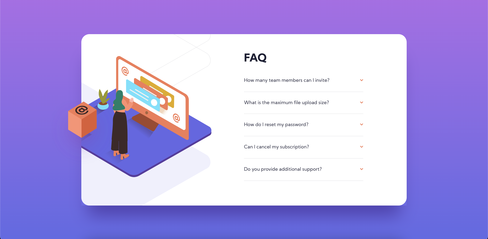

# Frontend Mentor - FAQ accordion card solution

This is a solution to the [FAQ accordion card challenge on Frontend Mentor](https://www.frontendmentor.io/challenges/faq-accordion-card-XlyjD0Oam). Frontend Mentor challenges help you improve your coding skills by building realistic projects.

## Table of contents

- [Overview](#overview)
  - [The challenge](#the-challenge)
  - [Screenshot](#screenshot)
  - [Links](#links)
- [My process](#my-process)
  - [Built with](#built-with)
  - [What I learned](#what-i-learned)
  - [Continued development](#continued-development)
- [Author](#author)

## Overview

### The challenge

Users should be able to:

- View the optimal layout for the component depending on their device's screen size
- See hover states for all interactive elements on the page
- Hide/Show the answer to a question when the question is clicked

### Screenshot

### Links

- Solution URL: [Frontend Mentor](https://your-solution-url.com)
- Live Site URL: [GitHub Pages](https://brendanmadden.github.io/faq-accordion-card/)

## My process

### Built with

- Semantic HTML5 markup
- CSS custom properties
- Flexbox
- CSS Grid

### What I learned

I learned a lot this challenge, and in getting prepared and organizing myself for it. I learned a lot about CSS grid, and I implemented it on a project for the first time here. I absolutely LOVE it, and I can't wait to keep using it. It works extremely well for laying out a project. It works really well with flexbox as well, and I'm glad that I learned to use it before starting to work on this project.

I also learned how to create an accordion with JavaScript for this project. It's my first time creating one, and surprisingly, it wasn't as difficult as I was expecting it might be. That being said, there are definitely a few ways I can improve on it.

### Continued development

My JavaScript accordion works, but it isn't perfect. I would like to figure out why the transition isn't taking effect when the accordion closes, and once I figure it out, I'll implement it here.

I also need to continue to work on my responsive design. Although I'm improving, there are so many ways that I can keep getting better. I plan on continuing to learn as much as I can about HTML, CSS and JavaScript as I continue to build these frontend mentor projects and my hope is that I will continue to learn and improve consistently.

## Author

- GitHub - [Brendan Madden](https://github.com/brendanmadden)
- Frontend Mentor - [@brendanmadden](https://www.frontendmentor.io/profile/brendanmadden)
- Twitter - [@BrendanMadden\_](https://www.twitter.com/BrendanMadden_)
